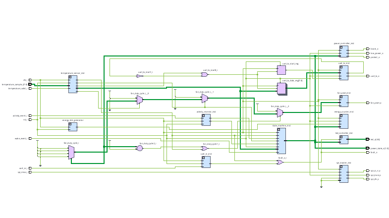
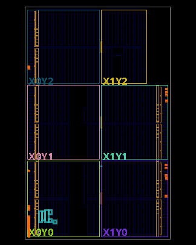

# 🌿 GreenChip

> **Energy-Aware FPGA Architecture**  
> A modular SystemVerilog FPGA design focused on intelligent power management, hardware monitoring, and sustainable embedded computing.

<p align="center">



</p>

---

## Overview

GreenChip is a SystemVerilog-based FPGA architecture designed to explore intelligent power management through dedicated hardware logic rather than software alone.

The project integrates multiple hardware modules that work together to monitor activity, temperature, communication interfaces, and system power while providing a scalable foundation for future sustainable computing research.

---

# FPGA Implementation

<p align="center">



</p>

The completed design was successfully synthesized, implemented, and mapped onto an AMD Artix-7 FPGA architecture using AMD Vivado 2026.1.

---

## Features

- Modular SystemVerilog RTL architecture
- UART communication
- SPI Master interface
- Temperature monitoring
- Activity monitoring
- PWM fan controller
- LED controller
- Energy counter
- Power controller
- Central state machine

---

## Design Flow

```text
Research
   ↓
Architecture
   ↓
RTL Design
   ↓
Simulation
   ↓
Synthesis ✅
   ↓
Implementation ✅
   ↓
Bitstream Generation ✅
```

---

## Project Status

| Stage | Status |
|--------|--------|
| RTL Design | ✅ Complete |
| Testbench Verification | ✅ Complete |
| Synthesis | ✅ Passed |
| Implementation | ✅ Passed |
| Bitstream Generation | ✅ Complete |

---

## Technologies

- SystemVerilog
- AMD Vivado 2026.1
- Icarus Verilog
- GTKWave
- Git
- GitHub

---

## Repository Structure

```text
GreenChip
│
├── rtl/
├── tb/
├── constraints/
├── docs/
├── images/
│   ├── greenchip-rtl-schematic.png
│   └── greenchip-fpga-floorplan.png
└── README.md
```

---

## Future Work

- Hardware validation on an Artix-7 FPGA
- Live sensor integration
- Real-time power monitoring
- AI-assisted energy optimization
- Expanded peripheral support

---

## Author

**A'Yana Leonard**

Electrical & Computer Engineering Research

*Building sustainable hardware solutions through FPGA design and digital systems engineering.*
